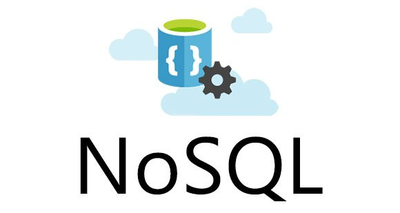

<h1 align="center">
  
</h1>

### Banco de dados
Eu entendo que o banco de dados é um local onde é armazenado/agrupado informações específicas. 
Por exemplo, me cadastro no site do mercado livre porque quero comprar um chuveiro. Para onde as informações do meu login, senha, nome, idade, endereço, etc...,  vão? Para o banco de dados. No back-end é mapeado o que cada tabela irá guardar e organizar.

<h1 align="center">
  
</h1>

### SQL
É uma linguagem que trabalha com bancos de dados relacionais. É usada para executar comando em bancos de dados relacionais, isto é, baseado em tabelas. Não necessita de profundos conhecimentos de programação para que alguém possa começar a escrever queries e consultas que trazem resultados de acordo com o que você está buscando.

<h1 align="center">
  
</h1>

### NoSQL
É um sistema de banco de dados não relacional. Os bancos de dados NoSQL podem ser consultados usando APIs de linguagem idiomática, linguagens de consulta estruturadas declarativas e linguagens de consulta. O uso de bancos de dados NoSQL permitirá que você tenha maior escalabilidade e maior economia no dia a dia, pois, não exige um hardware muito potente.

<h1 align="center">
  
</h1>

### MongoDB
É um banco de dados opensource, de alta performance e flexível, sendo considerado o principal banco de dados NoSQL. O MongoDB é orientado a documentos, ou seja, os dados são armazenados como documentos, ao contrário de bancos de dados de modelo relacional, onde trabalhamos com registros em linhas e colunas. Os documentos podem ser descritos como dados no formato de chave-valor, no caso, utilizando o formato JSON (JavaScript Object Notation).